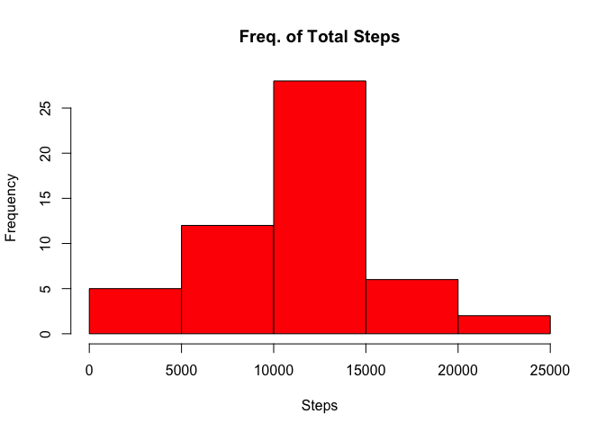
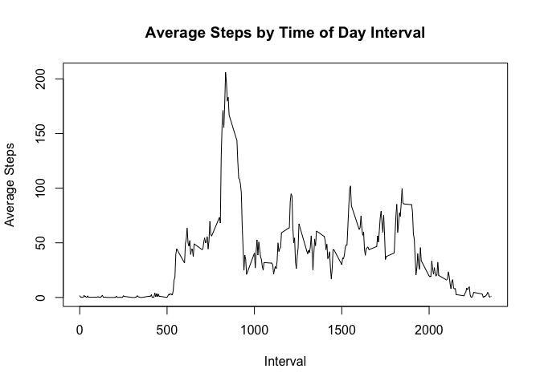
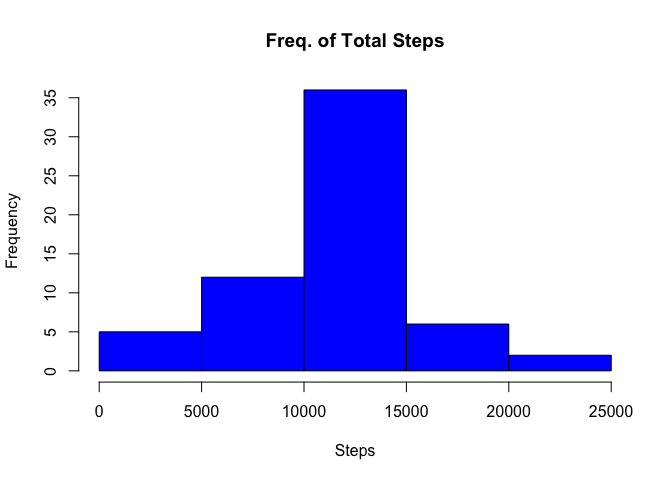
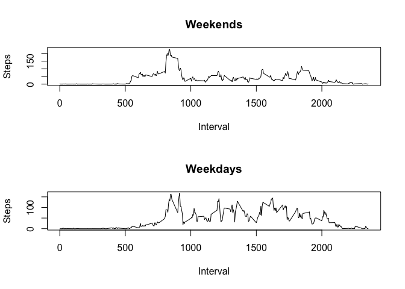

# Reproducible Research - Course Project 1
Danielle Boucher  
November 27, 2016  


## Activity Monitoring Data
### Loading and preprocessing the data

In this project, we will be working with the **activity monitoring data set** available [here.] [1] This data set has been unzipped and saved to our active working directory. Next, we will read the table into R, and take a look at it:  
  

```r
activitydata <- read.csv("activity.csv")
head(activitydata)
```

```
##   steps       date interval
## 1    NA 2012-10-01        0
## 2    NA 2012-10-01        5
## 3    NA 2012-10-01       10
## 4    NA 2012-10-01       15
## 5    NA 2012-10-01       20
## 6    NA 2012-10-01       25
```

```r
str(activitydata)
```

```
## 'data.frame':	17568 obs. of  3 variables:
##  $ steps   : int  NA NA NA NA NA NA NA NA NA NA ...
##  $ date    : Factor w/ 61 levels "2012-10-01","2012-10-02",..: 1 1 1 1 1 1 1 1 1 1 ...
##  $ interval: int  0 5 10 15 20 25 30 35 40 45 ...
```

Great! Looks like this data set is pretty straightforward - 3 dimensions and 17568 observations. Of course, it makes more sense to convert **date** to a date:  

```r
activitydata$date <- as.Date(activitydata$date)
str(activitydata)
```

```
## 'data.frame':	17568 obs. of  3 variables:
##  $ steps   : int  NA NA NA NA NA NA NA NA NA NA ...
##  $ date    : Date, format: "2012-10-01" "2012-10-01" ...
##  $ interval: int  0 5 10 15 20 25 30 35 40 45 ...
```

We're also going to want some summarized data sest, to view the total number of steps taken by date, and the average number of steps by interval:  

```r
activitysum <- aggregate(activitydata$steps ~ activitydata$date, FUN=sum)
head(activitysum)
```

```
##   activitydata$date activitydata$steps
## 1        2012-10-02                126
## 2        2012-10-03              11352
## 3        2012-10-04              12116
## 4        2012-10-05              13294
## 5        2012-10-06              15420
## 6        2012-10-07              11015
```

```r
intervalmean <- aggregate(activitydata$steps ~ activitydata$interval, FUN=mean)
head(intervalmean)
```

```
##   activitydata$interval activitydata$steps
## 1                     0          1.7169811
## 2                     5          0.3396226
## 3                    10          0.1320755
## 4                    15          0.1509434
## 5                    20          0.0754717
## 6                    25          2.0943396
```

### What is mean total number of steps taken per day?
Let's take a look at some of the key attributes of the summary data.  
We'll make a *histogram* and check the *mean* and *median*:

```r
hist(activitysum$`activitydata$steps`, col="RED", xlab="Steps", main="Freq. of Total Steps")
```

<!-- -->

```r
mean(activitysum$`activitydata$steps`, na.rm=TRUE)
```

```
## [1] 10766.19
```

```r
median(activitysum$`activitydata$steps`, na.rm=TRUE)
```

```
## [1] 10765
```


### What is the average daily activity pattern?
Great! Next we'll try to better understand average activity by day, using the **intervalmean** summary we created.  


```r
plot(intervalmean$`activitydata$interval`, intervalmean$`activitydata$steps`, type="l", xlab="Interval", ylab="Average Steps", main="Average Steps by Time of Day Interval")
```

<!-- -->

```r
intervalmean[which.max(intervalmean$`activitydata$steps`),]
```

```
##     activitydata$interval activitydata$steps
## 104                   835           206.1698
```

Okay, so we can see how the number of steps taken throughout the day looks, on average. We can also see that interval 835 has the maximum average steps, at 206.  

### Imputing missing values
Let's move on. The data set has a number of missing values that may be impacting our results. It would be valuable to try and remove this bias. Here's some code from replacing the missing values with the average for that interval:  


```r
## How many missing values for steps are there? 
summary(is.na(activitydata$steps))
```

```
##    Mode   FALSE    TRUE    NA's 
## logical   15264    2304       0
```

```r
activitydataclean <- activitydata
activitydataclean$steps[is.na(activitydataclean$steps)] <- with(activitydataclean, ave(steps, interval, FUN = function(x) mean(x, na.rm = TRUE)))[is.na(activitydataclean$steps)]
str(activitydataclean)
```

```
## 'data.frame':	17568 obs. of  3 variables:
##  $ steps   : num  1.717 0.3396 0.1321 0.1509 0.0755 ...
##  $ date    : Date, format: "2012-10-01" "2012-10-01" ...
##  $ interval: int  0 5 10 15 20 25 30 35 40 45 ...
```

```r
## Confirm that we replaced all
summary(is.na(activitydataclean$steps))
```

```
##    Mode   FALSE    NA's 
## logical   17568       0
```

Okay! Comparing that to our first *str()* call from the beginning of this document, we can see that we've successfully replaced the NAs with average values for the interval in question! Let's see now how our summary data compares:


```r
activitysum2 <- aggregate(activitydataclean$steps ~ activitydataclean$date, FUN=sum)
hist(activitysum2$`activitydataclean$steps`, col="BLUE", xlab="Steps", main="Freq. of Total Steps")
```

<!-- -->

```r
mean(activitysum2$`activitydataclean$steps`, na.rm=TRUE)
```

```
## [1] 10766.19
```

```r
median(activitysum2$`activitydataclean$steps`, na.rm=TRUE)
```

```
## [1] 10766.19
```

The shape of our histogram has stayed the same, but the frequency of each bucket has increased. The mean and median have not changed much at all. This tells me that we've probably chosen an acceptable method of cleaning the missing values.  

### Are there differences in activity patterns between weekdays and weekends?
Moving on... Let's see what correlations exist between steps taken, and day of the week. 


```r
weekdays1 <- c('Monday', 'Tuesday', 'Wednesday', 'Thursday', 'Friday')
activitydataclean$weekday <- factor((weekdays(activitydataclean$date) %in% weekdays1), levels=c(FALSE, TRUE), labels=c('weekend', 'weekday'))
summary(activitydataclean$weekday)
```

```
## weekend weekday 
##    4608   12960
```

```r
weekenddata <- subset(activitydataclean, activitydataclean$weekday == "weekday")
weekenddata <- aggregate(weekenddata$steps ~ weekenddata$interval, FUN=mean)
weekdaydata <- subset(activitydataclean, activitydataclean$weekday == "weekend")
weekdaydata <- aggregate(weekdaydata$steps ~ weekdaydata$interval, FUN=mean)
par(mfcol=c(2,1))
plot(weekenddata$`weekenddata$steps` ~ weekenddata$`weekenddata$interval`, type="l", ylab="Steps", xlab="Interval", main="Weekends")
plot(weekdaydata$`weekdaydata$steps` ~ weekdaydata$`weekdaydata$interval`, type="l", ylab="Steps", xlab="Interval", main="Weekdays")
```

<!-- -->

Okay... interesting results! That's all we'll look at in the activity data set, for now!

[1]: https://d396qusza40orc.cloudfront.net/repdata%2Fdata%2Factivity.zip
